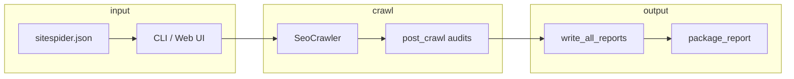

# SiteSpider 架構說明（設計）

## 資料流

1. **設定**：`site_config.py` 合併 JSON/YAML 與 CLI 參數。  
2. **爬取**：`crawler.py` 產生 `CrawlReport`（pages、robots、sitemap、issues）。  
3. **稽核**：`post_crawl.py` 全站規則（重複內容、錨文字、圖片…）。  
4. **匯出**：`report.write_all_reports` 呼叫各 `export_*` 模組。  
5. **交付**：`report_readme` + `package_report` 給顧問/客戶。

## 三種「報告」不要混淆

| 檔案 | 用途 | 受眾 |
|------|------|------|
| `index.html` | SF 風格表格瀏覽 | 技術 SEO |
| `dashboard.html` | 圖表與健康分 | 簡報 |
| `REPORT-zh.md` | 從哪看起、檔案對照 | 顧問/客戶入口 |
| `priority_summary.md` | 先修什麼 + 7 日 | 執行 |
| `SEO-AUDIT-zh.md` | 長文客戶報告（可選） | 客戶書面 |

## GSC 為可選外掛

- **預設路徑**：`rich_results.csv`（本機 JSON-LD）。  
- **可選路徑**：`gsc_inspection.py` → `rich_results_gsc.csv`。  
- 無客戶授權時：**不要**在設定檔設 `gsc.inspect_max`。

## Web 控制台

- **靜態 UI**：`ui/dashboard.html`  
- **API**：`server.py` + `server_config.py`  
- 爬取結果在 `reports/{job_id}/`，與 CLI `-o` 目錄結構相同。

## 擴充新功能時

- 新 **CSV 分頁** → `sf_reports.py` + `export_all_sf_reports` + `write_all_reports` 檔名列表。  
- 新 **全站規則** → `issues.py` 標籤 + `post_crawl.py`。  
- 新 **交付物** → `DELIVERY_FILES` in `package_report.py` + `REPORT-zh.md` 說明。
